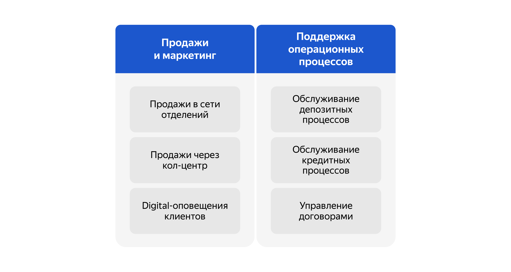
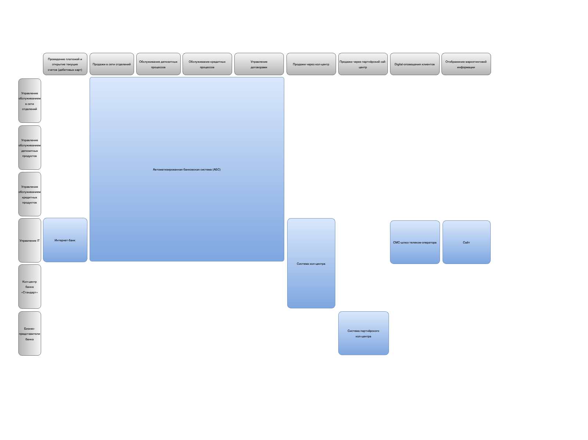

### Задание 1. Карта IT-ландшафта и схема интеграции приложений

### Карта бизнес-возможностей (Business Capability Map)

### Что нужно сделать
У вас есть Business Capabilty Map, а также описание организационной структуры предприятия и процессов. На основе этих данных создайте в draw.io:
1. Карту текущего IT-ландшафта. В строках она должна содержать элементы организационной структуры, а в колонках — бизнес-возможности второго уровня. Например, в строке стоит кол-центр, а в колонке — продажи через кол-центр.
2. Схему интеграции приложений с указанием участников процессов.

В директории Task1 должны лежать карта IT-ландшафта и схема интеграции приложений с пользователями.

### Карта текущего IT-ландшафта

### Схема интеграции приложений
