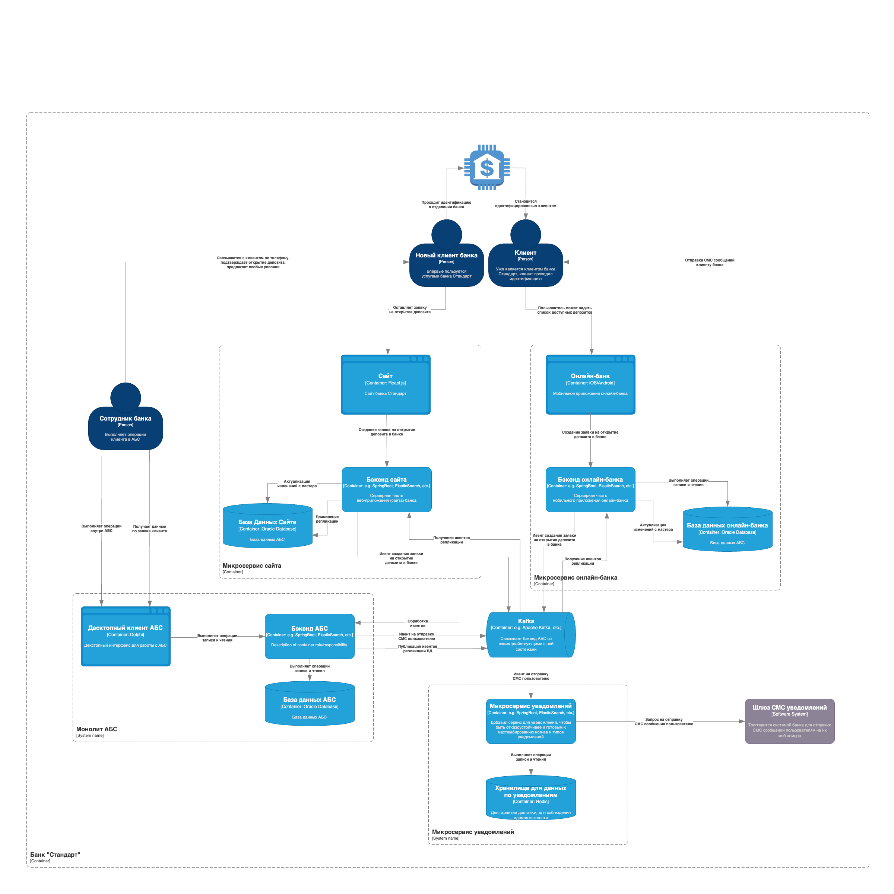

### **Название задачи:** Открытие депозитов онлайн 
### **Автор:** Байдин Владислав Андреевич
### **Дата:** 30.03.2025
### **Функциональные требования**
Опишите здесь верхнеуровневые Use Cases. Их нужно оформить в виде таблицы с пошаговым описанием:

| **№** | **Действующие лица или системы** | **Use Case**                                                                                                                                      | **Описание**                                                                                                                                                                                                                                                                                                                                                            |
|:-----:|:---------------------------------|:--------------------------------------------------------------------------------------------------------------------------------------------------|:------------------------------------------------------------------------------------------------------------------------------------------------------------------------------------------------------------------------------------------------------------------------------------------------------------------------------------------------------------------------|
|  UC1  | Новый клиент                     | Я, как новый клиент банка, могу видеть список доступных депозитов с актуальными ставками на сайте                                                 | 1. Клиент заходит на сайт    2. Клиент видит отображение доступных депозитов   3. Ставки по депозитам актуальны                                                                                                                                                                                                                                                 |
|  UC2  | Новый клиент                     | Я, как новый клиент банка, могу оставить заявку на открытие депозита, указав свой номер мобильного телефона на сайте                              | 1. Клиент заходит на веб-форму заполнения заявки на открытие депозита   2. Клиент указывает свой мобильный номер телефона   3. Система валидирует введённые данные клиента                                                                                                                                                                                      |
|  UC3  | Новый клиент                     | Я, как новый клиент банка, должен придти в банк для идентификации личности                                                                        | 1. Клиент подает заявку на открытие депозита   2. Менеджер одобряет заявку   3. Менеджер связывается с клиентом   4. Клиент приходит в отделение банка для идентификациии личности и получения документов                                                                                                                                                   |
|  UC4  | Клиент                           | Я, как клиент банка, могу получить специальные условия по заявке на открытие депозита с сайта от менеджера по телефону, после одобрения заявки    | 1. Клиент оформляет депозит на выгодные для банка сроки/суммы 2. Менеджер предлагает клиенту особые условия по телефону                                                                                                                                                                                                                                             |
|  UC5  | Клиент                           | Я, как клиент банка, могу видеть в онлайн-банке список доступных депозитов с актуальными ставками и персонализированными ставками лично для меня  | 1. Клиент входит в свою учётную запись  2. Система рассчитывает персонализированные предложения для клиента   3. Онлайн-банк отображает клиенту стандартные и персонализированные преложения по открытию депозита клиенту                                                                                                                                       |
|  UC6  | Клиент                           | Я, как клиент банка, могу указать счёт, сумму депозита и могу подать заявку на открытие депозита                                                  | 1. Клиент заходит в свою учётную запись онлайн-банка/сайта   2. Клиент указывает в форме счёт, сумму депозита   3. Клиент подаёт заявку на открытие депозита                                                                                                                                                                                                    |
|  UC7  | Клиент                           | Я, как клиент банка, должен подтвердить заявку на открытие депозита через онлайн-банк вводом из СМС сообщения                                     | 1. Клиент оставляет заявку на открытие в онлайн-банке   2. Шлюз система СМС отправляет клиенту код в СМС сообщении   3. Клиент подтверждает заявку на открытие депозита через онлайн-банк вводом кода из СМС сообщения                                                                                                                                          |
|  UC8  | Клиент                           | Я, как клиент банка, должен получить СМС уведомление после подтверждения размера ставки и открытия депозита менеджером                            | 1. Клиент подаёт заявку   2. Менеджер подтверждает заявку   3. Менеджер открывает депозит   4. Клиент получает СМС уведомление                                                                                                                                                                                                                              |
|  UC9  | Клиент                           | Я, как клиент банка, могу выполнять операции на сайте и онлайн-банке за милисекунды                                                               | 1. Клиент взаимодействует с онлайн-банком или сайтом   2. Любая выполненная операция имеет тайм-аут 1 секунду   3. При возникновении тайм-аута отдаём клиенту неудачный ответ или закэшированные данные, где это целесообразно                                                                                                                                  |
| UC10  | Менеджер                         | Я, как менеджер банка, должен обработать заявку клиента на открытие депозита                                                                      | 1. Клиент подаёт заявку   2. Менеджер обрабатывает заявку клиента                                                                                                                                                                                                                                                                                                   |
| UC10  | Менеджер                         | Я, как менеджер банка, должен перезвонить клиенту, подавшему заявку на депозит                                                                    | 1. Клиент подаёт заявку   2. Менеджер одобряет   3. Менеджер перезванивает клиенту                                                                                                                                                                                                                                                                              |
| UC11  | Менеджер                         | Я, как менеджер банка, должен изучить заявку и предложить при наличии специальные условия клиенту                                                 | 1. Клиент подал заявку на открытие   2. Менеджер одобряет заявку   3. Менеджер звонит для подтверждения и предложения особых условий                                                                                                                                                                                                                            |
| UC12  | Менеджер                         | Я, как менеджер банка, должен подтвердить условия депозита в АБС банка                                                                            | 1. Клиент открыл депозит в банке   2. Менеджер зафиксировал изменения в АБС                                                                                                                                                                                                                                                                                         |
| UC14  | Сотрудник бэк офиса кредитов     | Я, как сотрудник, бэк офиса направления кредитов имею возможность работать с XLS-файлами ставок по кредитам                                       | 1. Сотрудник выходит бэк офиса направления кредитов входит в свою учётную запись   2. Сотрудник бэк офиса направления кредитов имеет доступ к нужным операциям в XLS-файле для ведения ставок кредита                                                                                                                                                               |
| UC15  | Сотрудник бэк офиса депозитов    | Я, как сотрудник, бэк офиса направления депозитов имею возможность работать с XLS-файлами ставок по депозитам                                     | 1. Сотрудник выходит бэк офиса направления депозитов входит в свою учётную запись   2. Сотрудник бэк офиса направления депозитов имеет доступ к нужным операциям в XLS-файле для ведения ставок депозита                                                                                                                                                            |
| UC16  | Шлюз СМС уведомлений             | Я, как шлюз система СМС уведомлений, должна предоставить клиенту СМС с кодом подтверждения заявки на открытие депозита через онлайн-банк          | 1. Клиент запрашивает открытие депозита через онлайн-банк   2. Система банка обрабыватывает заявку   3. Система банка триггерит СМС шлюз для отправки кода подтверждения клиенту                                                                                                                                                                                |
| UC17  | Шлюз СМС уведомлений             | Я, как шлюз система СМС уведомлений, должна предоставить клиенту СМС с уведомлением о подтверждении размера ставки и открытии депозита менеджером | 1. Клиент запрашивает открытие депозита через сайт банка   2. Менеджер открывает после проверки депозит клиенту   3. Менеджер фиксирует изменения по открытию депозита в АБС   4. Система банка треггирит шлюз СМС для отправки уведомления клиенту об открытии депозита в банке и пришглашением посетить офис лично для проведения процедуры идентификации |

### **Нефункциональные требования**
Опишите здесь нефункциональные требования и архитектурно-значимые требования.

| **№** | **Требование**                                                                  |
|:-----:|:--------------------------------------------------------------------------------|
|   1   | Сервисы должны быть доступны 24/7 с доступностью не менее 99,9%                 |
|   2   | Реализовать механизм переключения на резервный ЦОД в случае сбоя                |
|   3   | Время отклика всех операций не более секунды                                    |
|   4   | Минимизировать прямую работу интернет-банка с АБС                               |
|   5   | Оптимизировать работу с базами данных MS SQL и Oracle                           |
|   6   | Шифрование трафика между клиентом, сайтом, интернет-банком и АБС                |
|   7   | Использовать существующий СМС-шлюз телеком-оператора для подтверждения операций |
|   8   | Документировать архитектуру и бизнес-процессы                                   |
|   9   | Использовать существующие технологии банка                                      |

### **Решение**
Приведите диаграммы контекста и контейнеров в модели C4. Опишите там основные компоненты и интеграции всех элементов решения. 

### Диаграмма C4 Context

### Диаграмма C4 Container

Также опишите, какой логикой вы руководствовались в ходе принятия решений и выбора технологий. Не забывайте, что необходимо учесть все функциональные и нефункциональные требования.
### **Альтернативы**
Опишите здесь наиболее важные альтернативные решения.

**Недостатки, ограничения, риски**

Подробно опишите здесь недостатки, ограничения и риски выбранного решения.

