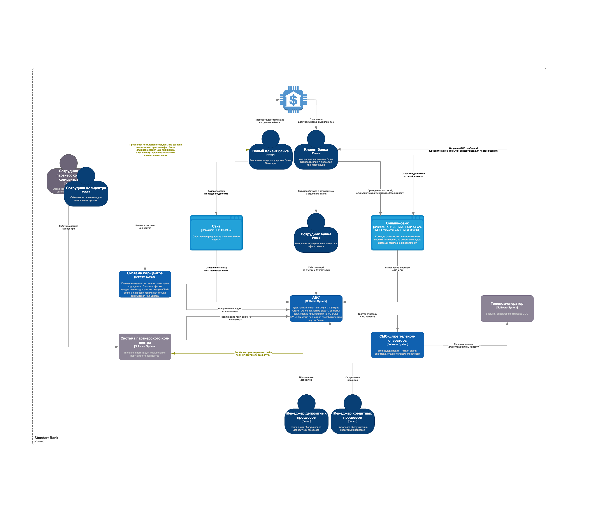
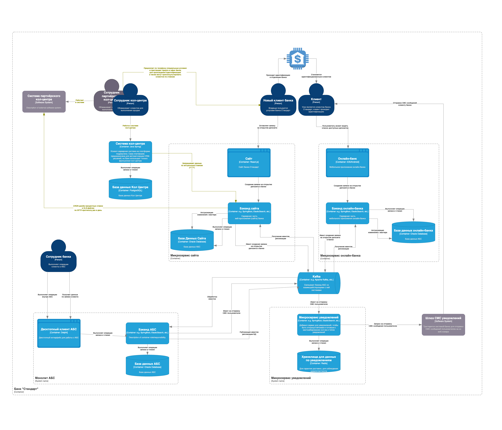

### **Название задачи: Передача ставок в кол-центр** 
### **Автор: Байдин Владислав Андреевич**
### **Дата: 30.03.2025**
### **Функциональные требования**
Опишите здесь верхнеуровневые Use Cases. Их нужно оформить в виде таблицы с пошаговым описанием:

| **№** | **Действующие лица или системы**  | **Use Case**                                                                                                      | **Описание**                                                                                                                                                                                                                      |
|:-----:|:----------------------------------|:------------------------------------------------------------------------------------------------------------------|:----------------------------------------------------------------------------------------------------------------------------------------------------------------------------------------------------------------------------------|
|  1.   | АБС                               | Я, как система АБС, должна доставлять данные по ставкам в систему call-центра                                     | Система call-центра запрашивает данные по HTTP-протоколу, используя приватную ручку АБС-системы                                                                                                                                   |
|  1.   | АБС                               | Я, как система АБС, должна доставлять данные по ставкам в систему партнёрского call-центра                        | АБС система выполняет джобу по CRON раз в день для экспорта XLS-файлов со ставками в партнёрский call-центр                                                                                                                       |
|  2.   | Система call-центра               | Я, как система call-центра, должна запрашивать данные по ставкам по HTTP-протоколу у АБС системы                  |                                                                                                                                                                                                                                   |
|  3.   | Система патрнёрского call-центра  | Я, как система патрнёрского call-центра, могу принимать данные по ставкам по SFTP-протоколу                       |                                                                                                                                                                                                                                   |
|  4.   | Менеджер call-центра              | Я, как менеджер call-центра, могу проконсультировать клиента по телефона по актуальным ставкам банка              | Менеджер call-центра имеет возможность проконсультировать клиента по ставкам банка, потому что он может прямо во время разговора через интерфейс системы call-центра вызвать ручку АБС системы для получения процентов по ставкам |
|  5.   | Менеджер патрнёрского call-центра | Я, как менеджер патрнёрского call-центра, могу проконсультировать клиента по телефона по актуальным ставкам банка | Менеджер патрнёрского call-центра имеет возможность проконсультировать клиента по ставкам банка, потому что АБС система регулярно раз в день доставляет XLS-файлы в систему партнёрского call-центра                              |
### **Нефункциональные требования**
Опишите здесь нефункциональные требования и архитектурно-значимые требования.

| **№** | **Требование**                                                                                                            |
|:-----:|:--------------------------------------------------------------------------------------------------------------------------|
|  1.   | API эндпоинт для передачи данных по процентам ставок должен быть доступен для вызова системой call-центра банка           |
|  2.   | CRON джоба от АБС-системы должна регулярно запускаться в интервале один раз в день                                        |
|  3.   | В случае неудачной попытки передача файла должен быть предусмотрен ретрай передачи                                        |
|  4.   | Менеджер call-центра имеет доступ в веб-интерфейсе на запрос и чтение данных по процентным ставкам банка                  |
|  4.   | Менеджер call-центра должен иметь возможность предоставить консультацию клиентам по актуальным ставкам банка              |
|  5.   | Система партнёрского call-центра должна иметь возможность импортировать данные себе для работы их менеджеров              |
|  6.   | Менеджер партнёрского call-центра должен иметь возможность предоставить консультацию клиентам по актуальным ставкам банка |
### **Решение**
### С4 Context диаграмма: 

### С4 Container диаграмма: 

### **Альтернативы**
<b>Отправка файла после формирования (event-based):</b> запуск скрипта отправки сразу после формирования XLS (например, через post-processing хук или inotify).
Даёт возможность отправлять файл сразу по его готовности, предоставляя возможность срочного обновления файла и минимально задержки изменений, но это дороже и сложнее. 

Примечание: так как жёстко сязаны SFTP-протоколом по заданию больше альтернатив не было найдено.

### **Недостатки**
1. <b>Нет контроля успешной передачи:</b> SFTP может завершиться ошибкой, и об этом не узнают без ручной проверки
2. <b>Жёстко заданное расписание (раз в сутки):</b> нельзя быстро доставить файл, если требуется обновление чаще или вне графика
3. <b>Отсутствие логов и уведомлений:</b> неудобно отлаживать ошибки, если передача не сработала
